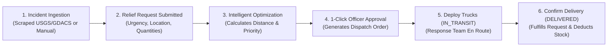
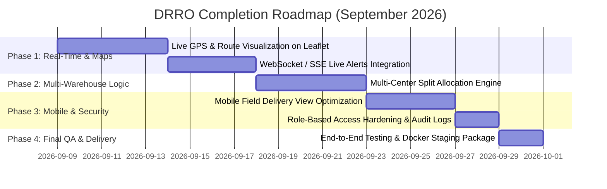
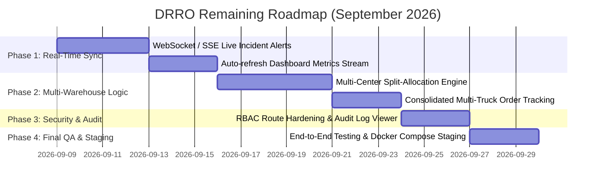

# DRRO Project Status Report & Month-End Roadmap

**Project**: Disaster Resource Response Optimizer (DRRO)  
**Date**: 08 September 2026  
**Target Completion Date**: End of this Month  

---

## 1. Executive Summary

Today, the core operational workflows of the DRRO platform were unified, debugged, and verified. The system now supports an end-to-end disaster response lifecycle—from real-time web scraping and relief request ingestion, through multi-objective greedy optimization and 1-click officer approvals, to field dispatch tracking and automated inventory fulfillment.

---

## 2. Completed Tasks Summary

### 📊 Dashboard & Command Center Overhaul
- **Emergency Command Shortcuts**: Replaced misleading placeholder routes with 4 direct emergency actions:
  - 🚨 **Report Disaster** (`/disasters/create`)
  - 🆘 **New Relief Request** (`/requests/create`)
  - 🚑 **Dispatch Teams** (`/teams`)
  - 📦 **Add Inventory** (`/resources/inventory/add`)
- **Two-Column Command Layout**: Restructured the dashboard into a responsive two-column layout featuring an **Unmet Demand by Location** panel on the left and a compact **Live Incident Feed** with severity tags and timestamps on the right.
- **Dark Mode Visibility**: Fixed color contrast tokens for the critical attention alert banner and the notification dropdown panel so text is high-contrast and readable across all themes.
- **Unmet Demand Data Fix**: Resolved empty resource name fields by optimizing the query with a single `JOIN FETCH` over `RequestItem`, `Request`, `Location`, and `ResourceType`.

---

### 📄 Publication-Grade PDF Report Generation
- **Engine Rebuilt**: Completely rewrote the OpenPDF generator in `ReportPdfService.java`.
- **Structured Sections Included**:
  1. **Executive Operational Header** with dynamic time-zone formatting and classification banner.
  2. **Key Performance Indicators (KPI) Summary Grid** (Active Disasters, Open Requests, Low Stock Alerts, Fulfillment Rate).
  3. **Critical Unmet Demand Table** with exact quantities, units, and urgency levels.
  4. **Resource Center Inventory Utilization Breakdown** (Available vs. Reserved vs. Total Capacity).
  5. **Algorithm Benchmark Comparison Table** (Greedy Priority vs. FCFS vs. Proportional Sharing).
- **Access & Permissions**: Configured endpoint to allow authenticated operational personnel to download the report without permission errors.

---

### ⚡ Allocation, Approval & Dispatch Lifecycle
- **Optimization Engine Fixes**: Updated `AllocationService.java` to automatically evaluate all `PENDING`, `OPEN`, and `VERIFIED` relief requests against warehouse stocks.
- **1-Click Review & Approval UI**: Added inline **`[✓ Approve & Dispatch]`** and **`[✕ Reject]`** action buttons right on each recommendation card on the Allocation page (`/allocation`).
- **Interactive Attention Banner**: Upgraded the dashboard attention banner with direct shortcuts: `[⚡ Run Optimizer & Allocate]`, `[✓ Review Approvals]`, and `[View Requests]`.
- **Field Delivery Operations**: Enhanced the Dispatch Tracking table (`/dispatch`) with direct **`[🚚 Start Transit]`** and **`[✓ Confirm Delivery]`** actions, which immediately mark requests as fulfilled and update dashboard metrics to 100%.

---

### 📦 Disaster Archiving & Dataset Trimming
- **Active vs. Archives Separation**: Added dedicated **`🚨 Active Incidents`** (default view) and **`📦 Archives`** (closed incidents) tabs on `/disasters`.
- **1-Click Close & Archive**: Operational commanders can close and archive incidents with one click.
- **Cascade Deletion & Restore**: Added cascade cleanup of orphaned records and a restore option for emergency re-openings.
- **Dataset Optimization**: Trimmed the active disasters database down to the **50 most recent records**.

---

## 3. Disaster Response Lifecycle Workflow

---

## 4. Remaining Tasks Roadmap (To Complete by Month-End)

### Detailed Task Breakdown:

### 🗺️ Interactive Route Map & Mobile Field Manifest (Completed)
- [x] **Leaflet Transit Polylines**: Connected origin Resource Centers (Warehouses) to destination disaster shelters with color-coded routes (`#7c3aed` for in-transit, `#059669` for delivered).
- [x] **In-Transit Truck Markers**: Added moving/waypoint vehicle icons (`🚚`) with interactive payload tooltips on hover and click.
- [x] **Mobile Field Manifest (`/dispatch/:id/deliver`)**: Mobile-first responsive UI with 1-tap **`[📍 Open GPS Maps]`** navigation.
- [x] **Digital Proof of Delivery (POD)**: Touchscreen signature canvas + camera photo upload preview for field verification.
- [x] **1-Click Allocation Dispatch Flow**: Auto-generates dispatch orders upon recommendation approval.

---

## 4. Remaining Tasks Roadmap (To Complete by Month-End)

### Detailed Remaining Task Breakdown:

#### 🔔 1. WebSocket / Server-Sent Events (SSE) Live Notifications
- [ ] Push instant push notifications to the top-bar bell when a high-severity disaster is ingested from GDACS/USGS or an urgent request is submitted.
- [ ] Auto-refresh dashboard charts and unmet demand tables upon new allocation decisions without manual browser refresh.

#### 📦 2. Multi-Warehouse Split-Allocation Engine
- [ ] Support split-order allocations when a single disaster's demand exceeds the capacity of the closest warehouse (e.g., 60% from Warehouse A, 40% from Warehouse B).
- [ ] Group multi-center dispatches under a unified relief request tracking manifest.

#### 🔒 3. Security, RBAC & Audit Trails
- [ ] Implement backend and frontend permission hardening per role (`ADMIN`, `COMMANDER`, `LOGISTICS_OFFICER`, `FIELD_RESPONDER`).
- [ ] Build an Audit Log Viewer screen in Admin settings to track who approved, rejected, or modified allocations with timestamps.

#### 🚀 4. Production Hardening & Packaging
- [ ] Expand integration test suite for greedy optimization edge cases and inventory concurrency.
- [ ] Package multi-container `docker-compose.yml` for unified Spring Boot + Vite + PostgreSQL staging deployment.
- [ ] Final UI styling polish and documentation export.
